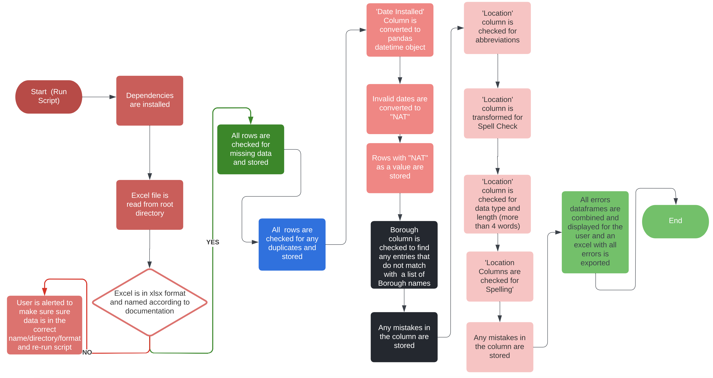

# NYC Department Of Transportation: Data Cleaning Error Log
<a href="url"></a>

## Repository Overview

This repository contains a script that was developed for the NYC DOT that generates an error log for the 'accessible-pedestrian-signals.xlsx' dataset. Accessible Pedestrian Signals (APS) are devices affixed to pedestrian signal poles to assist blind or low vision pedestrians in crossing the street.  The excel file contains information on the street intersection, Borough, and date installation of these devices. Data cleaning is required so that the file can be properly used for further application development, such as for geocoding purposes. The error log outputs the excel row #, the row values, and the specific error type. A process diagram can be found at the end of this documentation and the 'DataCleaningErrorLog.ipynb' file contains comments that explain the functionality of the code.

A sample of the dataset can be downloaded from the [NYC City Goverment Website](https://www1.nyc.gov/html/dot/html/infrastructure/accessiblepedsignals#:~:text=NYC%20DOT's%20Accessible%20Pedestrian%20Signals,button%20installed%20at%20the%20crosswalk.) and is previewed below:


**Errors Checked:**
-  *Missing Data:* fields with null data 
-  *Duplicated Data:* rows that are an exact match with another row in the dataset
- *'Location' Column - Schema:* data type =  string, contains more than 4 words
- *'Location' Column - Consistency in Street Abbreviations:* any abbreviations that are not consistent with the full abbreviation
- *'Location' Column - Spelling:* street names that are misspelt
- *'Date Installed' Column - Schema:* values that are not formatted as a date type
- *'Borough' Column - Schema:* values with incorrect spelling, capitalization, or data type 


### Files in this repository:
> `DataCleaningErrorLog.ipynb` - the main script ran on Jupyter Notebook that provides a full formatted error log organzied by row index.  

> `DataCleaningErrorLog.py` - a version of the main script that can be run on terminal. Contains the row # and error type, exluding the row fields.

> `customdict.txt` - a txt file that contains all numerical street names in NYC and custom words that should pass pyspellcheck. User can edit this file to add any words that should pass spell check that is not included in the current dictionaries.

> `streetdict.txt` - a txt file from [NYC Open Data](https://data.cityofnewyork.us/City-Government/Street-Name-Dictionary/w4v2-rv6b) that contains an official NYC Street Name Dictionary. Data has been cleaned to remove numeric characters from alphanumeric street names.

> `/img` - images used in README.md file to preview sample data and script.


## Prerequisites
Confirm Python 3 and PIP (package installer for python) are installed on your local machine by running the following commands. If not, refer to the installation documentation for [Python 3](https://www.python.org/downloads/) and [PIP](https://pip.pypa.io/en/stable/installation/)

```bash
python3 --version
pip --version
``` 
Once Python 3 and PIP are installed, clone the project to your desired local directory and install the python dependencies by running the following commands:
   ```sh
   git clone https://github.com/msyed5/DOT-SCRIPT.git
   ```

```bash
pip install notebook
pip install pandas
pip install regex
pip install pyspellchecker
``` 
## Instructions for Usage: 

### Running Jupyter Notebook Script

1. Confirm the target excel file is named 'accessible-pedestrian-signals.xlsx'. Manually add the file to the project directory using your file manager
2. Use terminal to navigate to the project directory 
   ```sh
    cd DOT-SCRIPT
    pwd
   ```
3. Open the Jupyter Notebook Script 
   ```sh
    jupyter notebook DataCleaningErrorLog.ipynb
   ```
4. Navigate to the Jupyter Notebook menu bar and run the script --> **Kernel > Restart and Run All**
5. Scroll through the notebook to view error logs for each error type or go to the end of the notebook to view the full error log. An excel file with the error log is exported to the project directory.
   
   
   
   
6. Errors can be corrected manually or with a seperate data cleaning script (Link here when ready)
7. Rereun the script to confirm errors were corrected.

### Running Terminal Version of Script
1. Confirm the target excel file is named 'accessible-pedestrian-signals.xlsx'. Manually add the file to the project directory using your file manager
   ```sh
    cd DOT-SCRIPT
    pwd
   ```
2. Run the Python Script 
   ```sh
    python DataCleaningErrorLogTerminal.py
   ```
3. Terminal will output an abridged version of the full error script. An excel file with the error log is exported to the project directory.

   

4. Errors can be corrected manually or with a seperate data cleaning script (Link here when ready). 
5. Rereun the script to confirm errors were corrected.

## Workflow Overview

The diagram below provides an overall process view of the script. Errors are found in the set using the 'Pandas' library and stored in seperate dataframes that are concatenated and then displayed to the user.



### Additional Resources
- [General Data Cleaning Methodology](https://www.acaps.org/sites/acaps/files/resources/files/acaps_technical_brief_data_cleaning_april_2016_0.pdf)
- [Pandas Library Documentation](https://pandas.pydata.org/docs/)
- [PySpellCheck Library Documentation](https://pypi.org/project/pyspellchecker/)

